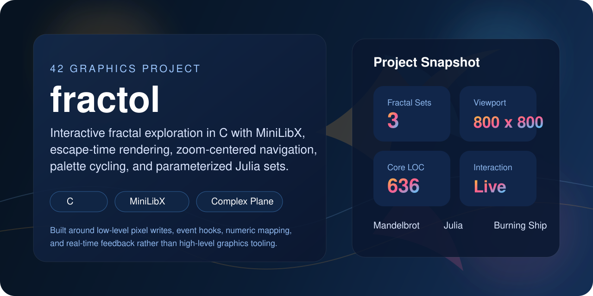
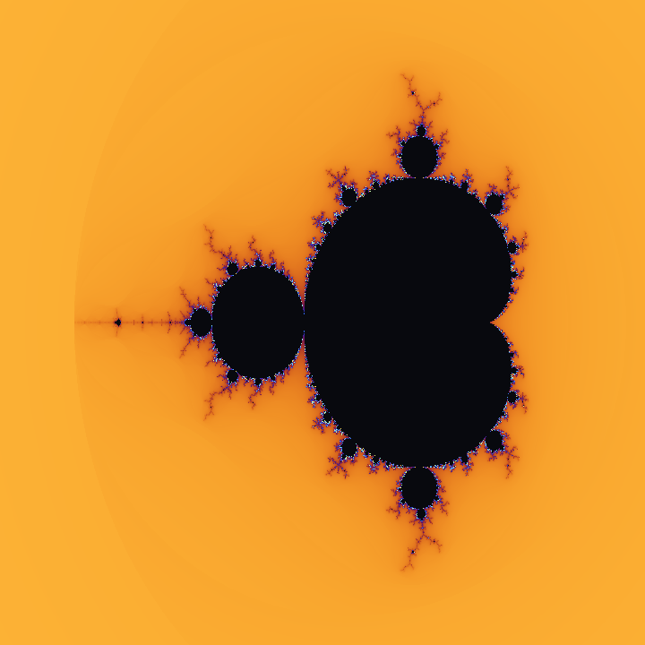
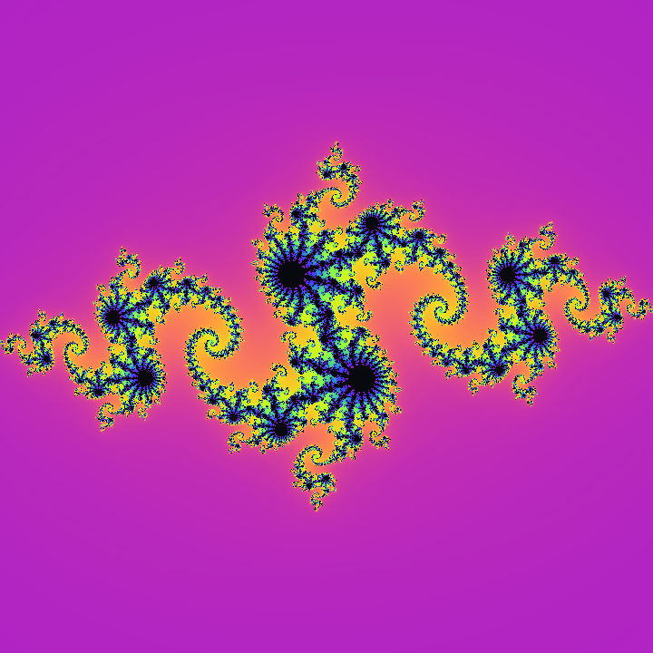
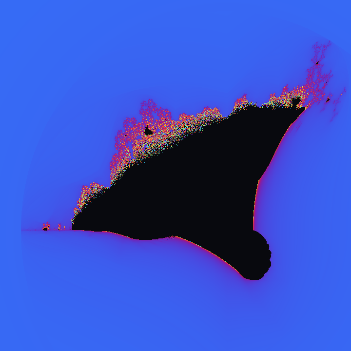
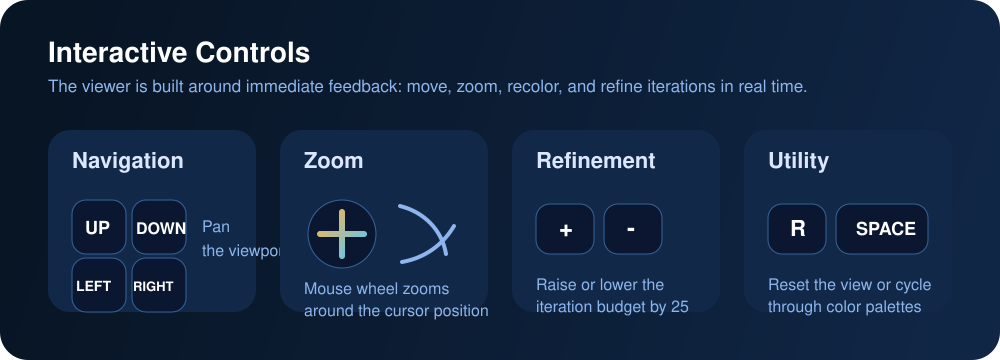
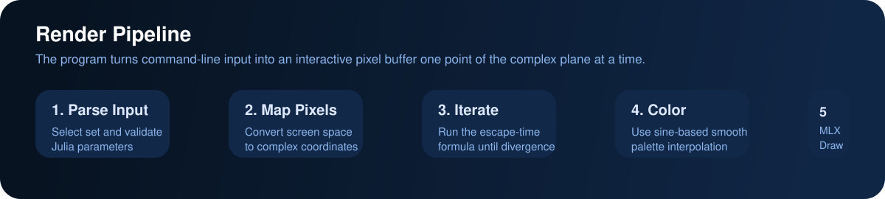

# fractol

<p align="center">
  
</p>

## Overview

`fractol` is a 42 graphics project written in C that renders and explores mathematical fractals in real time. The application supports **Mandelbrot**, **Julia**, and **Burning Ship** sets, then lets the user zoom, pan, recolor, and increase iteration depth interactively through MiniLibX.

At its core, this project is about turning abstract math into a responsive visual system with very little abstraction help: direct pixel-buffer writes, event hooks, coordinate remapping, floating-point calculations, and careful rendering decisions.

## Why This Project Matters

This is the kind of project that shows more than syntax knowledge:

- It demonstrates comfort with **low-level graphics programming** in C.
- It shows the ability to translate **mathematical models into working software**.
- It highlights **event-driven thinking**, not just linear command-line logic.
- It reflects an understanding of **performance tradeoffs**, because image quality and responsiveness are constantly in tension.
- It proves ownership under constraints: no game engine, no plotting library, no high-level UI toolkit.

## Quick Snapshot

- **Language:** C
- **Graphics library:** MiniLibX
- **Viewport:** `800 x 800`
- **Supported sets:** `Mandelbrot`, `Julia`, `Ship`
- **Default depth:** `70` iterations
- **Dependencies:** local `libft`, local `ft_printf`, MiniLibX
- **Core source size:** about `636` lines across the project files

## Gallery

<p align="center">
  
  
  
</p>

<p align="center">
  <sub>Left: Mandelbrot | Center: Julia example | Right: Burning Ship</sub>
</p>

## Controls

<p align="center">
  
</p>

| Action | Input |
| --- | --- |
| Zoom in / out | Mouse wheel |
| Move around the plane | Arrow keys |
| Increase / decrease detail | `+` / `-` |
| Cycle color palette | `Space` |
| Reset zoom | `R` |
| Exit | `Esc` or close window |

## Build And Run

This repository is set up for the **42 macOS MiniLibX / OpenGL** environment.

```bash
make
./fractol Mandelbrot
./fractol Julia -0.4 0.6
./fractol Ship
```

Notes:

- The current `Makefile` links against `OpenGL` and `AppKit`, so it is aimed at the school macOS setup.
- `Julia` expects two numeric parameters: real and imaginary components.
- The README preview images were generated offline with [`scripts/generate_readme_assets.py`](scripts/generate_readme_assets.py).

## How It Works

<p align="center">
  
</p>

For each pixel on the screen, the program:

1. maps the pixel position to a point in the complex plane,
2. applies the selected fractal formula iteratively,
3. checks whether the value escapes past the divergence radius,
4. converts the iteration count into a color,
5. writes that color into the image buffer,
6. displays the final frame in the window.

This project uses the classic **escape-time algorithm**, which is one of the simplest and most elegant bridges between pure mathematics and computer graphics.

## Technical Highlights

- **Mouse-centered zoom:** zooming is anchored around the cursor rather than the middle of the screen, which makes navigation feel much more natural.
- **Direct framebuffer writes:** pixels are written into the image buffer first, then displayed in a single `mlx_put_image_to_window` call.
- **Interactive refinement:** iteration depth can be adjusted live, letting the user trade speed for detail.
- **Smooth palette logic:** colors are derived from sine-based interpolation rather than a flat hard-coded lookup, which creates more fluid gradients.
- **Multiple fractal families:** the code handles three distinct formulas with shared rendering infrastructure.

## What I Learned

This project taught me how to think about graphics at a much lower level than usual:

- how to map a 2D screen into a mathematical coordinate system,
- how floating-point precision affects visual output,
- how event hooks and render loops shape application structure,
- how to build intuition for complex numbers through code,
- how small math mistakes can completely change a rendered result,
- how important it is to separate rendering, validation, input handling, and utility logic.

It also reinforced a broader engineering lesson: once software becomes interactive, correctness is not enough. The experience has to feel intuitive too.

## Main Difficulties

The hardest parts were not the lines of code themselves, but the behavior behind them:

- **Keeping zoom intuitive:** it is easy to zoom mathematically, but much harder to zoom in a way that feels centered on what the user actually cares about.
- **Balancing detail and responsiveness:** higher iteration counts improve image richness, but they also increase render cost immediately.
- **Handling multiple coordinate conventions:** Mandelbrot, Julia, and Burning Ship do not all feel identical once zooming and vertical movement are involved.
- **Getting color output to look good:** fractals can be mathematically correct and still visually disappointing if the palette logic is weak.
- **Debugging numeric behavior:** fractal rendering bugs often look like "bad art" rather than obvious crashes, which makes diagnosis more subtle.

## Optimization Decisions

This project is still intentionally simple, but several choices already move it in the right direction:

- **One off-screen image buffer per frame** avoids expensive per-pixel window operations.
- **Plain iterative loops** keep the hot path straightforward and predictable.
- **Shared utility functions** reduce repeated mapping and color logic.
- **Configurable iteration count** gives the user direct control over the quality/performance tradeoff.
- **Tight scope and small abstractions** make it easier to reason about correctness in the render path.

If I extended this further, the next performance steps would be multithreading, selective redraw strategies, and deeper numerical smoothing for color continuity.

## Academic Value

From an academic and training perspective, `fractol` is a strong exercise because it connects several important topics at once:

- **complex analysis basics** through iterative formulas,
- **computer graphics fundamentals** through raster rendering,
- **event-driven programming** through keyboard and mouse hooks,
- **numerical reasoning** through floating-point transformations,
- **software architecture** through separating parsing, rendering, events, and utilities,
- **resource management** through manual initialization and cleanup in C.

It is a compact project, but it develops the kind of mental model that carries into graphics, simulations, UI tooling, performance-sensitive systems, and scientific visualization.

## Project Structure

| File | Responsibility |
| --- | --- |
| `1main.c` | startup, initialization, user guidance |
| `2checks.c` | argument validation and Julia parameter parsing |
| `3render.c` | Mandelbrot and Julia rendering |
| `4events.c` | mouse and keyboard interactions |
| `5utils1.c` | mapping, cleanup, pixel write, smooth coloring |
| `5utils2.c` | reset and palette switching |
| `6ship.c` | Burning Ship rendering |
| `header.h` | shared types, constants, prototypes |

## Closing Thought

`fractol` is a good example of the kind of work I enjoy: mathematical ideas, visible output, low-level control, and a direct connection between implementation choices and user experience. It started as an academic graphics assignment, but it became a practical exercise in rendering, interaction design, debugging, and disciplined C programming.
